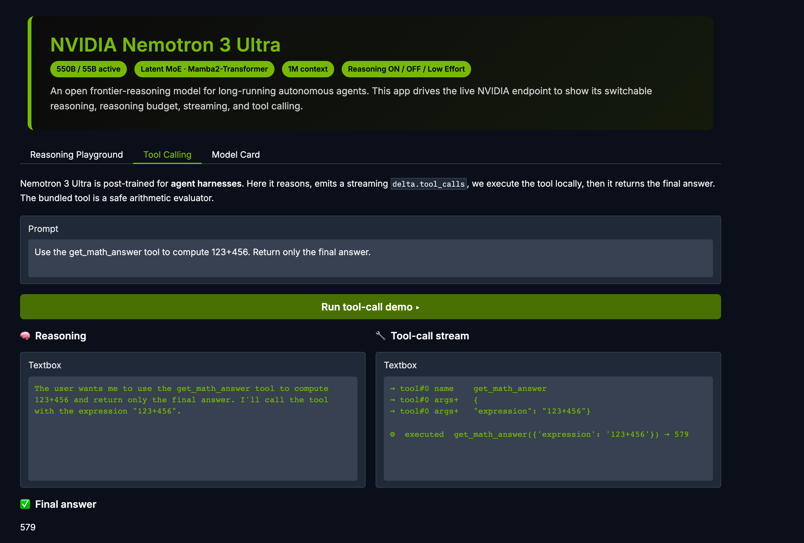

# NVIDIA Nemotron 3 Ultra: A Reasoning Engine Built For The Harness

**NVIDIA Nemotron 3 Ultra is an open frontier-reasoning model designed for one thing: to sit inside an agent harness and run for a long time without falling over.**

I spent time with the model against its live endpoint. Below is what stands out, with a working Gradio app I built to exercise each feature.

---

### In Short

- Nemotron 3 Ultra is a **550B total / 55B active** parameter Large Reasoning Model.
- The architecture is a **Latent Mixture-of-Experts (LatentMoE) Hybrid Mamba2-Transformer**.
- Context length runs up to **1M tokens**.
- Reasoning is a *switch*, not a fixed trait — **ON / OFF / Low Effort**, with an optional **reasoning budget**.
- It is post-trained for **agent harnesses**, not chat.

That last line is the whole point.

---

### The Model Is Not The Product. The Harness Is.

I keep coming back to one idea.

Most of the intelligence we attribute to "the model" actually lives in the orchestration around it.

NVIDIA seems to agree. Nemotron 3 Ultra is described as *post-trained for agent harnesses using openly available samples and environments*. It is engineered for **complex orchestration, deep research, and extended coding sessions**.

The reviewer guidance is explicit. Evaluate the model *by itself*, or **through a harness** — OpenCode, or NemoClaw powered by a Hermes Agent.

So the model is shipped as a component. A reasoning engine you drop into a runtime. The interesting work is what you wrap around it.

---

### Three Architectural Decisions Worth Understanding

**1. Latent Mixture-of-Experts.**

A dense model activates every parameter for every token. Nemotron 3 Ultra does not.

Instead of routing raw tokens, it routes **continuous latent representations** — hidden states — to specialised expert networks. The result: a 550B knowledge base, but only **55B parameters active per forward pass**.

Lower latency. Smaller memory footprint. Cheaper to run at scale.

**2. Multi-Token Prediction (MTP).**

Standard LLMs guess one token at a time.

Nemotron 3 Ultra is trained to predict **multiple future tokens in a single forward pass**. Two consequences: higher tokens-per-second, and a model that *plans* its reasoning trajectory rather than stumbling forward one word at a time.

**3. NVFP4 Pretraining.**

The model was pre-trained in NVIDIA's **4-bit floating-point (NVFP4)** format.

4-bit *during training*, not just at inference. This roughly doubles training throughput versus 8-bit and eases memory-bandwidth pressure — which buys a larger, richer training set without losing gradient precision.

The through-line: **efficiency is the feature.** More reasoning cycles per unit of time budget.

---

### Reasoning Is A Dial, Not A Switch

This is the part I find most useful in practice.

Nemotron 3 Ultra has three distinct modes, controlled through `chat_template_kwargs`:

| Mode | Parameter | Behaviour |
|---|---|---|
| Reasoning ON | `enable_thinking: true` | Full Large Reasoning Model. Extended chains of thought. |
| Reasoning OFF | `enable_thinking: false` | Behaves like a normal LLM. Direct answers, no thinking. |
| Low Effort | `low_effort: true` | Thinks, but briefly. Fewer reasoning tokens. |

And there is a fourth lever — the **reasoning budget**:

```json
{
  "chat_template_kwargs": {
    "enable_thinking": true,
    "reasoning_budget": 2048
  }
}
```

This caps the number of thinking tokens. A direct knob on the trade-off between **reasoning depth** and **latency**.

The practical guidance from NVIDIA is worth repeating: *before reaching for `reasoning_budget`, try `low_effort: true` first.*

Here is the playground from my app, running **Low Effort** mode against the live endpoint. Reasoning tokens stream in green on the left; the answer renders on the right.


One detail to note. With thinking on, the model may emit *empty* `<think></think>` tags. That is expected — it has decided it does not need to think to answer confidently. The reasoning is conditional, and the model owns that decision.

---

### Streaming And Tool Calls: The Agentic Surface

A reasoning engine for agents has to do two things visibly well — **stream**, and **call tools**.

The endpoint is wrapped around the OpenAI API, so the surface is familiar. Reasoning arrives as `delta.reasoning`. Tool calls arrive incrementally as `delta.tool_calls` — function name first, then JSON arguments token by token, then a `tool_calls` finish reason.

I wired a small arithmetic tool into the app to show the full loop: the model reasons, emits a streaming tool call, the tool executes locally, and the result is fed back for a final answer.



A practical note from building this. The model resends the tool **name** across more than one delta. Accumulate naively and you end up dispatching to `get_math_answerget_math_answer`, which matches nothing. Take the name once; concatenate only the arguments.

It is a tiny detail. It is also exactly the kind of harness-level glue that decides whether your agent works or silently fails. **The model emitted a perfect tool call. The integration code is what nearly broke it.**

---

### What It Is Good At

The model's stated strengths sit squarely in **systems architecture, mathematical reasoning, and advanced logic**.

The sample prompts in the reviewer guide are not toys — design a multi-region trading platform at 100k TPS; solve a constrained supply-chain optimisation with exact costs; write a production FastAPI Stripe webhook with retry logic for deadlocks; reason through a multi-actor IP-law scenario.

These are deep, multi-step, professional tasks. Which is the point. This is a model meant to *complete work*, not to chat.

A deployment note: reasoning mode is verbose. NVIDIA recommends `max_tokens >= 64,000`, and up to **264K** for reasoning-on workloads. Budget for it.

---

### Deployment

A few things make this practical at scale.

- A **unified NVFP4 checkpoint** runs on both **Blackwell and Hopper**. One checkpoint, two generations of hardware.
- The OpenAI-compatible endpoint means existing tooling mostly just works.
- It slots into agent frameworks — **Hermes** and **OpenClaw** inside the **NemoClaw** runtime — by pointing the custom endpoint at the model.

```bash
openclaw onboard --non-interactive \
  --auth-choice custom-api-key \
  --custom-base-url https://integrate.api.nvidia.com/v1 \
  --custom-model nvidia/nemotron-3-ultra-550b-a55b
```

Recommended settings across all modes: **temperature 1.0, top_p 0.95.**

---

### Considering Everything

Nemotron 3 Ultra is a clear statement about where open models are heading.

Not bigger dense models. **Efficient, switchable reasoning engines built to live inside a harness** — LatentMoE for cheap capacity, MTP for throughput, NVFP4 for training economics, and reasoning you can turn up, turn down, or budget to the token.

The model is strong. But it is delivered as a part.

What you build around it — the orchestration, the tool loop, the budget policy, the retry logic — is where the system actually becomes intelligent.

That is the harness. And the harness is the work.

---

*The Gradio app used for every screenshot here is in this repository. Set `NVIDIA_API_KEY`, run `python app.py`, and exercise the model yourself.*

*Model naming follows NVIDIA's guidance: NVIDIA Nemotron (family), Nemotron 3 Ultra (model), NVIDIA-Nemotron-3-Ultra-550B-A55B (full technical name).*
