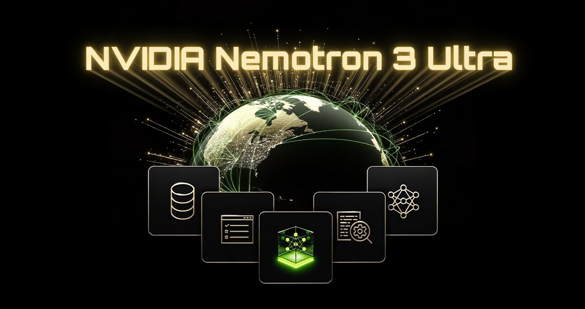

# NVIDIA Nemotron 3 Ultra — Feature Showcase



A Gradio app that drives the live **NVIDIA Nemotron 3 Ultra** endpoint
(`NVIDIA-Nemotron-3-Ultra-550B-A55B`) to demonstrate its headline features, styled
in NVIDIA green.


## What it shows

- **Reasoning modes** — `Reasoning ON` (`enable_thinking: true`), `Reasoning OFF`, and
  `Low Effort` (`low_effort: true`), switched live via `chat_template_kwargs`.
- **Reasoning budget** — a slider that caps thinking tokens (`reasoning_budget`).
- **Streaming** — reasoning tokens stream in green, the answer renders alongside.
- **Tool calling** — streaming `delta.tool_calls`, local execution, then a final answer.
- **Model card** — architecture, context length, and recommended generation settings.

| Tab | Feature |
|---|---|
| Reasoning Playground | Modes, reasoning budget, streaming, sample prompts |
| Tool Calling | Streaming tool calls + local tool execution loop |
| Model Card | Architecture summary and recommended settings |

## Benchmarks

How Nemotron 3 Ultra (550B) compares against larger frontier models.


## Run it

Requires Python 3.10+ and an NVIDIA API key with access to the Nemotron 3 Ultra
private endpoint.

```bash
pip install -r requirements.txt
export NVIDIA_API_KEY="nvapi-..."   # never commit this — see .env.example
python app.py
```

Then open http://localhost:7860. The app binds to `127.0.0.1` by default; set
`GRADIO_SERVER_NAME=0.0.0.0` only if you intend to expose it on your LAN (it
holds a live API key).

## Configuration

| Setting | Value |
|---|---|
| Base URL | `https://integrate.api.nvidia.com/v1` |
| Model | `private/nvidia/nemotron-3-ultra-550b-a55b` |
| Temperature / top_p | `1.0` / `0.95` (recommended for all modes) |

The endpoint is OpenAI-compatible, so the app uses the `openai` Python client.

## Notes

- With thinking on, the model may emit empty `<think></think>` tags — expected when it
  decides it does not need to reason to answer confidently.
- Reasoning mode is verbose. The model card recommends up to 264K tokens with reasoning
  on; the UI slider is capped at 64K to keep the demo responsive — raise it in `app.py`
  if you need the full budget.
- The bundled tool is a safe arithmetic evaluator: it parses an AST and only permits
  `+ - * / %` over numbers (no `eval`, no `**`), used only to demonstrate the tool-call loop.

See [`BLOG.md`](BLOG.md) for the write-up.

## License

[MIT](LICENSE) © Cobus Greyling
